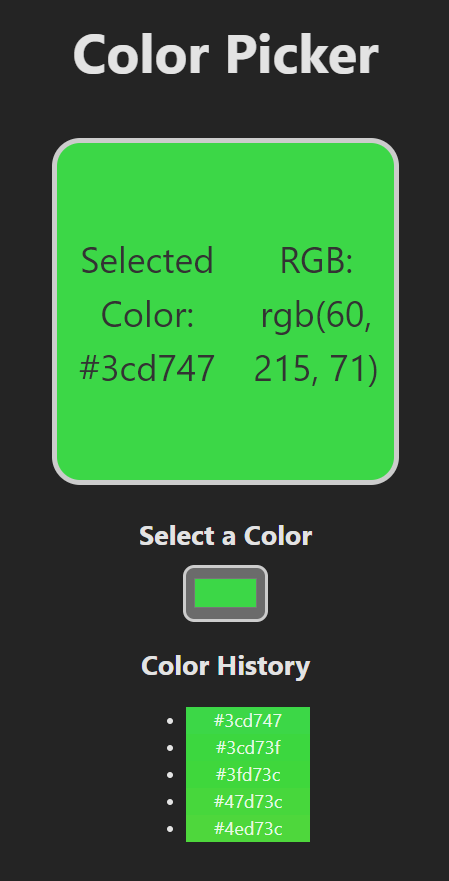

# Color Picker 


## Description
This is a simple Color Picker application built with React and Vite. The application allows users to select a color from an input, displays the selected color, and shows its corresponding RGB value. Additionally, it maintains a history of previously selected colors.

## Features
- Select a color using a color input.
- Display the selected color in both hex and RGB formats.
- Maintain and display a history of the last five selected colors.

## Technologies Used
- React
- Vite
- CSS

---

## Getting Started

### Prerequisites
Make sure you have the following installed on your machine:
- Node.js
- npm (Node Package Manager) or yarn

### Installation
1. Clone the repository:
    ```sh
    git clone https://github.com/botzaifa/color-picker.git
    ```
2. Navigate to the project directory:
    ```sh
    cd color-picker
    ```
3. Install the dependencies:
    ```sh
    npm install
    ```
    or
    ```sh
    yarn install
    ```

### Running the Application
To start the application, run:
```sh
npm run dev
```
or
```sh
yarn dev
```
The application should now be running on `http://localhost:3000`.

---

## Project Structure
```
color-picker/
├── public/
│   └── index.html
├── src/
│   ├── components/
│   │   └── ColorPicker.jsx
│   ├── styles/
│   │   └── ColorPicker.css
│   ├── App.jsx
│   ├── main.jsx
│   └── index.css
├── .gitignore
├── package.json
├── README.md
└── vite.config.js
```

### Components
- `ColorPicker.jsx`: The main component that handles color selection and display.
- `ColorPicker.css`: The CSS file for styling the Color Picker component.

### Scripts
- `dev`: Runs the application in development mode.
- `build`: Builds the application for production.
- `serve`: Serves the built application.

## Usage
1. Open the application in your web browser.
2. Select a color using the color input.
3. The selected color will be displayed along with its hex and RGB values.
4. The history of the last five selected colors will be shown below the color input.

## Contributing
Contributions are welcome! Please fork the repository and submit a pull request for any features, bug fixes, or improvements.

---


## UI Screenshot
`Here is a screenshot of the application UI:`





---

Thanks ~ **`Huzaifa <3`**